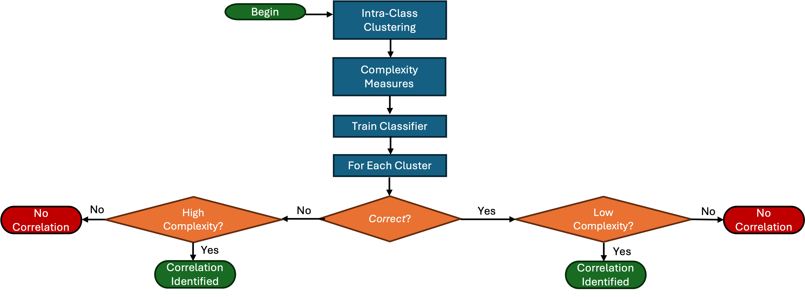

# Identifying Difficult Regions of the Data Space Prior to Classification

---

## Objective

The goal of this procedure is to identify regions of a labelled dataset that are **inherently difficult to classify before any classifier is trained**. The underlying hypothesis is that the geometric structure of the data space is itself predictive of classification failure: regions where classes overlap in feature space are hard to separate regardless of the learning algorithm. By characterising these regions in advance, it becomes possible to diagnose classification difficulty at its source — the data — rather than attributing failure post-hoc to model capacity or training dynamics.

The procedure is classifier-agnostic and is designed to handle tabular datasets with mixed feature types, imbalanced class distributions, and multimodal class structure. It consists of four sequential stages, depicted schematically in Figure 1:

1. **Intra-class clustering** — decompose the data space into compact, homogeneous sub-regions.
2. **Complexity measurement** — quantify the separability of each sub-region against all adversarial classes.
3. **Classifier training** — train an independent downstream classifier on the full dataset.
4. **Failure–complexity correlation** — assess whether pre-training complexity scores predict post-training failure rates.

*Figure 1. Schematic overview of the pipeline. Complexity analysis (Steps 1–2) is fully independent of classifier training (Step 3). The correlation in Step 4 closes the loop and validates the predictive procedure.*

**Transductive design.** Both the intra-class clustering (Step 1) and the complexity measures (Step 2) are computed on the union of the train, validation, and test splits. This is a deliberate choice, consistent with the goal of the procedure: the object under study is the geometric structure of the *data space itself*, not a model of it, so the diagnosis must observe the same population on which classification difficulty is later measured — including the test region. Two consequences follow. First, every conclusion drawn in Step 4 is **within-dataset**: the failure–complexity correlation quantifies how well geometry explains failure on *this* dataset; no claim of inductive generalisation (predicting failure on unseen data, or assigning new samples to clusters without knowing their labels) is made or implied. Second, an inductive variant would require fitting the clustering on the training split only and assigning validation/test samples a posteriori through a label-free rule (e.g. nearest centroid over *all* clusters, regardless of class), with the complexity measures recomputed accordingly.

**Data distribution and inclusion criteria.** The analysed dataset preserves the original class distribution: class balancing (random undersampling of the training split) is applied **at classifier-training time only**, controlled by the `balance` parameter, and never touches the persisted splits. This matters because the clustering is density-based — undersampling before the analysis would distort the very densities the diagnosis relies on, and asymmetrically so across splits. The only filter applied at preparation time is a **class inclusion criterion**: classes with fewer than `data.min_cat_count` samples are dropped, since they can be neither stratified across splits nor clustered meaningfully (any sub-region would fall below the minimum resolution discussed in Step 1). This is a declared property of the evaluated datasets, not a tuning knob.

---

## Step 1 — Intra-Class Clustering

The first step partitions each class into a set of compact, internally coherent sub-regions, which become the atomic units of all subsequent analysis.

**Why analyse at the cluster level (and use the class level only as a complementary reference).** Many real-world classes are multimodal: a single class may occupy multiple disconnected or geometrically distinct sub-regions of the feature space, each with different proximity relationships to other classes. Aggregating complexity measures only at the class level would conflate these differences and produce a single, uninformative summary. By operating primarily at the cluster level, the procedure can separately characterise the easy sub-regions of a class (well-separated from all other classes) and the hard ones (interleaved with foreign samples), providing a much finer-grained diagnostic. A parallel class-level computation (under the same neutral schema) is also produced as a coarse-grained reference: in Step 4 the failure classifier receives both, joining each cluster's row with the class-level row of its parent class (`cluster_*` and `class_*` feature prefixes).

**Why not analyse at the instance level.** Pushing the granularity to individual samples is equally problematic, for the opposite reason. Instance-level complexity measures are highly sensitive to noise and local density fluctuations: a single outlier or mislabelled sample can appear critically difficult while being entirely unrepresentative of any broader structural problem. More importantly, the complexity measures of interest — silhouette, MST boundary fraction, Fisher ratio — are inherently statistical quantities defined over populations of samples; they are either undefined or degenerate when applied to a single point. Clusters provide the minimum meaningful resolution at which these measures can be estimated reliably, while remaining compact enough to localise difficulty within the data space.

**Algorithm.** Clustering is performed independently per class using **HDBSCAN** (Hierarchical Density-Based Spatial Clustering of Applications with Noise). The choice is motivated by three properties: (1) HDBSCAN does not require a predetermined number of clusters — it infers the cluster structure directly from the data density; (2) it handles irregular cluster shapes and varying local density, which are common in real network traffic data; (3) it explicitly labels low-density samples as **noise** (cluster label $-1$), isolating them from well-defined sub-regions rather than forcing them into a nearest cluster. For ablation, four alternative partitioners are available under the same per-class protocol: k-means (centroid-based), spectral clustering (graph-based, non-convex), BIRCH (hierarchical), and k-prototypes (mixed-type, see below). Gaussian mixture models were evaluated and **excluded**: on the benchmark datasets they fragment pathologically (a large share of clusters below the minimum resolution, including singletons) while adding no modelling capability beyond k-means' convex-partition family.

**Hyperparameter selection.** The per-class grid search scores every candidate with a fragmentation-aware composite, $\text{score} = s \cdot (1 - r_{\text{noise}}) \cdot c_{\text{floor}}$, where $s$ is the silhouette on non-noise points, $r_{\text{noise}}$ the noise ratio, and $c_{\text{floor}}$ the fraction of clustered points belonging to clusters of at least `min_cluster_floor` samples. Plain silhouette alone is biased in two ways that the two penalty factors correct: computed on non-noise points only, it rewards configurations that dump points into noise and keep only clean cores; and it grows with fragmentation, so unconstrained it systematically selects the largest $K$ in the grid. Cluster-count candidates that are incompatible with the floor (i.e. $n/K <$ `min_cluster_floor`) are pruned before fitting and reported in the sweep.

**Cluster resolution band.** Two post-hoc passes enforce a size band $[\text{floor}, \text{target}]$ on every real cluster after fitting. First, clusters smaller than `min_cluster_floor` (default 50) are absorbed into the per-class noise pseudo-cluster: sub-regions below this size cannot support the statistical complexity measures of Step 2 (variance, silhouette, and PCA quantities are undefined or degenerate on a handful of points). Second, clusters larger than `target_cluster_size` (default 25 000) are split using MiniBatchKMeans on the full cluster points (not the fit subsample): the number of sub-clusters is $k = \min(\lceil n / \text{target} \rceil,\, n \mathbin{/\!/} \text{floor})$, the upper bound ensuring no sub-cluster falls below the floor in expectation. This split step is necessary because silhouette-based scoring systematically prefers coarse partitions at full-data scale — a handful of well-separated blobs maximises the score — so the grid search alone cannot enforce the fine-grained locality that failure diagnosis requires. By operating on the full cluster points rather than the fit subsample, the split captures the actual within-cluster structure independent of the 20 000-point sampling cap. The two passes together guarantee that every cluster used in Steps 2–4 sits in the band $[50, 25\,000]$, bounding both statistical validity (lower) and spatial locality (upper). Noise pseudo-clusters are excluded from splitting: their semantics is catch-all, not coherent sub-region, so splitting them would only produce fragments with no meaningful locality.

**Feature scope.** Clustering operates by default on the processed numerical features only. Including categorical features in the clustering distance would require computing Gower distance over the full mixed-type space for every pair of samples during the HDBSCAN fit — an $O(n^2 d)$ operation that is computationally prohibitive at dataset scale and difficult to approximate without sacrificing the density estimates that HDBSCAN relies on. Numerical features, after log-scaling and robust normalisation, provide a well-defined Euclidean space in which density-based clustering is both tractable and geometrically meaningful. Categorical features are incorporated later, in Step 2, where a sparse neighbourhood graph — rather than a full pairwise matrix — is sufficient. As a mixed-type alternative, the **k-prototypes** variant clusters on numerical *and* categorical features at linear cost (k-means on the numerics combined with matching dissimilarity on the categoricals, weighted by `gamma`); its grid candidates are scored with a silhouette computed on the same Gower-hybrid distance used by the Step 2 neighbourhood graph, evaluated on a bounded scoring subsample.

**Noise handling.** Samples that HDBSCAN cannot assign to any density-connected region receive a provisional label of $-1$. Rather than discarding them, noise points are collected per class and merged into a single per-class pseudo-cluster, which is assigned a fresh globally unique identifier. This ensures that every sample participates in the subsequent analysis: no data is lost, and the pseudo-clusters act as catch-all regions that aggregate the low-density, structurally ambiguous portions of each class.

**Output.** Each sample in the dataset is assigned a globally unique cluster label. Cluster identifiers are offset across classes to avoid collisions, so each label unambiguously identifies both the sub-region and, by construction, the class it belongs to.

---

## Step 2 — Complexity Measures

Each cluster $c$ is characterised by a vector of complexity measures, organised into five families (F, N, ND, T, G). All measures are computed on the processed feature representations (after log-scaling and robust normalisation of numerical features, and hash encoding of categoricals), making them directly comparable across datasets and runs.

For measures that are inherently pairwise — defined with respect to a specific adversarial partition $j$ (i.e., a partition of a different class) — the value is reported as the **minimum** (worst-case adversary), **mean** (average difficulty), and **maximum** (easiest adversary) over the **top-K nearest adversarial partitions**, ranked by centroid distance under `complexity.distance`. Reporting the minimum is particularly important: a partition may be easy to separate from most adversaries but critically exposed to one specific one, and this worst case is the one most likely to drive classifier failure. The same aggregation logic is applied identically at the cluster level (`complexity.json`) and at the class level (`class_complexity.json`).

**Distance metric for neighbourhood families.** The neighbourhood-based families (N, ND) require a dissimilarity measure that covers both numerical and categorical features. A **Gower-hybrid distance** is used: the numerical component is configurable (cosine or Euclidean, set via `complexity.distance`) and is combined with a Hamming-style indicator contribution on categoricals, with each contribution normalised to $[0, 1]$:

$$d_\text{hybrid}(x, x') = \frac{1}{d_\text{num} + d_\text{cat}} \left( \sum_{f=1}^{d_\text{num}} \delta_\text{num}(x_f, x'_f) + \sum_{f=1}^{d_\text{cat}} \mathbb{1}[x_f \ne x'_f] \right)$$

Computing the full pairwise distance matrix would be $O(n^2 d)$, which is prohibitive at dataset scale. Instead, only a sparse $k$-nearest-neighbour graph (default `complexity.k = 30`) is materialised — distances are computed in row batches and only the $k$ closest neighbours per sample are retained. This graph is constructed once and shared across all neighbourhood-based families, amortising its cost.

**Metric coherence.** The numerical component of the analysis metric must match the clustering metric: the neighbourhood topology analysed in this step has to be the one in which the clusters of Step 1 were formed, otherwise the measures describe a geometry different from the partition's. Coherence is enforced structurally: both `clustering.distance` and `complexity.distance` interpolate the single top-level `distance` key.

### Family F — Feature-Based Separability

These four measures assess how well the numerical features discriminate cluster $c$ from adversarial classes. They are computed on robust-scaled numerical features only, without any neighbourhood structure.

**F1 — Fisher discriminant ratio.** Normalised inverse of the maximum per-feature Fisher ratio. A value near zero means at least one feature provides strong linear separation; near one means no feature separates the two groups.

$$f_1(c, j) = \frac{1}{1 + \max_f \frac{(\mu_{c,f} - \mu_{j,f})^2}{\sigma^2_{c,f} + \sigma^2_{j,f}}}$$

**F2 — Bounding-box overlap ratio.** Mean fraction of per-feature value range shared between cluster $c$ and class $j$. Zero means no marginal overlap; one means complete overlap on every feature.

$$f_2(c, j) = \frac{1}{d} \sum_f \frac{\max(0,\, \min(c_{\max,f}, j_{\max,f}) - \max(c_{\min,f}, j_{\min,f}))}{\max(c_{\max,f}, j_{\max,f}) - \min(c_{\min,f}, j_{\min,f})}$$

**F3 — Best single-feature separability.** Fraction of cluster-$c$ samples inside the feature-wise overlap region, minimised over features. A low value implies the existence of at least one feature that fully separates the cluster; a high value means every feature partially confounds cluster $c$ with class $j$.

$$f_3(c, j) = \min_f \frac{|\{x \in c : lo_f \le x_f \le hi_f\}|}{|c|}$$

**F4 — Joint-feature overlap fraction.** Fraction of cluster-$c$ samples that fall inside the overlap region on all features simultaneously. Unlike F3, this captures joint multi-dimensional overlap and is insensitive to marginal separability.

$$f_4(c, j) = \frac{|\{x \in c : \forall f,\; lo_f \le x_f \le hi_f\}|}{|c|}$$

### Family N — Neighbourhood-Based Separability

These measures characterise local class structure in the k-NN graph (Gower distance, $k = 5$), capturing class intermingling at the sample level. All four share the same graph and are therefore computed simultaneously. Noise samples are excluded from cluster membership but may appear as neighbours.

**N1 — MST boundary fraction.** Fraction of cluster-$c$ samples adjacent to a class-$j$ sample in an approximate minimum spanning tree over $c \cup j$.

$$n_1(c, j) = \frac{|\{x \in c : \exists\, (x, y) \in \text{MST},\; y \in j\}|}{|c|}$$

**N2 — Intra/inter nearest-neighbour distance ratio.** For each $x \in c$, ratio of its nearest same-cluster distance to the sum of intra- and inter-cluster distances, averaged over the cluster. A value of 0.5 indicates that the local neighbourhood provides no discriminative signal; values above 0.5 indicate that adversarial samples are locally closer than same-cluster samples.

$$n_2(x) = \frac{d_{\text{intra}}}{d_{\text{intra}} + d_{\text{inter}}}$$

**N3 — 1-NN error rate.** For each $x \in c$, probability that its nearest neighbour in $c \cup j$ belongs to class $j$. Equivalent to the empirical error of a 1-NN classifier restricted to the binary problem $c$ vs. $j$.

$$n_3(c, j) = \frac{|\{x \in c : \mathrm{NN}_{c \cup j}(x) \in j\}|}{|c|}$$

**N4 — k-NN majority-vote error rate.** Fraction of cluster-$c$ samples for which the majority of their $k$ nearest neighbours in $c \cup j$ belong to class $j$. More robust to local outliers than N3.

$$n_4(c, j) = \frac{|\{x \in c : \text{votes}_j(x) > \text{votes}_c(x)\}|}{|c|}$$

### Family ND — Network Density

**Cross-class k-NN density.** Fraction of k-NN edges from cluster $c$ that point to class-$j$ samples. Whereas the N family reasons per sample, this measure gives a global summary of how strongly cluster $c$ is coupled to class $j$ in the neighbourhood graph.

$$\text{density}(c, j) = \frac{\sum_{x \in c} |\{nb \in \mathrm{NN}(x) : nb \in j\}|}{|c| \times k}$$

### Family T — Intrinsic Dimensionality

These three measures assess the dimensionality regime of the cluster relative to its size and the feature space, providing a proxy for the curse of dimensionality within the cluster.

**T2 — Feature-to-sample ratio.** Ratio of total features (numerical and categorical) to cluster size. Values significantly greater than one indicate an underdetermined regime where reliable generalisation within the cluster becomes questionable.

$$T_2 = \frac{d_{\text{num}} + d_{\text{cat}}}{n_c}$$

**T3 — PCA intrinsic dimensionality ratio.** Fraction of numerical features needed to explain 95% of intra-cluster variance. Low values indicate high feature redundancy; values close to one indicate that features carry nearly independent information.

$$T_3 = \frac{n_{\text{PCA}_{95\%}}}{d_{\text{num}}}$$

**T4 — PCA components-to-sample ratio.** Ratio of the number of PCA components required for 95% variance to the cluster size. High values indicate that the effective dimensionality of the cluster is comparable to its population.

$$T_4 = \frac{n_{\text{PCA}_{95\%}}}{n_c}$$

### Family G — Cluster Geometry

These six measures characterise geometric properties of the cluster in the metric space configured via `complexity.distance` (numerical features only). Silhouette-based quantities are approximated via stratified subsampling (at most 10,000 points) to manage the $O(n^2 d)$ cost of exact pairwise distance computation.

**Maximum dispersion.** Maximum distance from any cluster sample to the centroid $\mu_c$. Indicates whether the cluster is compact or diffuse.

$$\text{maxDisp}(c) = \max_{x \in c} \|x - \mu_c\|$$

**95th-percentile dispersion.** Outlier-robust counterpart to maximum dispersion — the 95th percentile of sample-to-centroid distances.

**Distance to nearest centroid.** Minimum centroid-to-centroid distance from partition $c$ to any other partition (under `complexity.distance`). A small value indicates high spatial collision risk with at least one neighbouring partition.

$$d_{\text{nearest}}(c) = \min_{c' \ne c} \|\mu_c - \mu_{c'}\|$$

**5th-percentile silhouette score.** The 5th percentile of the silhouette distribution within the partition, computed on non-noise samples under the configured metric. Focusing on the 5th percentile rather than the mean highlights the most boundary-exposed samples.

$$s(x) = \frac{b(x) - a(x)}{\max(a(x), b(x))}, \quad a(x) = \text{mean intra-partition dist}, \quad b(x) = \text{mean dist to nearest other partition}$$

**Fraction at risk.** Fraction of partition samples with silhouette score $< 0$, i.e., samples closer to another partition than to their own centroid. Directly quantifies the proportion of boundary-ambiguous samples.

$$\text{fracAtRisk}(c) = \frac{|\{x \in c : s(x) < 0\}|}{|c|}$$

---

## Step 3 — Classifier Training

A downstream classifier is trained on the preprocessed training split using a standard supervised learning procedure. The pipeline supports both classical ML estimators (sklearn, XGBoost) and deep neural networks (PyTorch + Ignite, with early stopping on validation loss and best-model checkpointing); the choice is controlled by the `classifier` config group. Class balancing of the training split (random undersampling, `balance=undersample`) is applied here, at training time, as part of the classifier's recipe — the analysed dataset itself keeps the original distribution. Training is intentionally performed **after** the complexity analysis is complete: the complexity measures are a pre-training diagnostic and carry no information from the classifier.

**Failure rate per cluster.** After evaluation on the held-out test set, a failure rate is computed for each cluster as the fraction of test samples in that cluster for which the classifier produces an incorrect prediction:

$$\text{failure\_rate}(c) = \frac{|\{x \in c_{\text{test}} : \hat{y}(x) \ne y(x)\}|}{|c_{\text{test}}|}$$

This metric directly links the cluster partition established in Step 1 to the classifier's observed behaviour, enabling a principled comparison between pre-training complexity and post-training performance. The failure rate is undefined for clusters with no test representation, and statistically unreliable for clusters with very few test samples — both cases are handled by explicit inclusion criteria in Step 4.

---

## Step 4 — Failure–Complexity Correlation

The final step asks whether the complexity vector computed in Step 2 is predictive of the failure rate computed in Step 3. This is operationalised as a binary classification problem: each cluster is labelled *failed* or *correct* (labeling criterion below), and a **Random Forest** is then trained to predict this binary label from the cluster's complexity feature vector.

**Failure labeling.** The default labeling is **significance-based**: a cluster is *failed* when its error count is significantly above the classifier's pooled test error rate $p$, under a one-sided binomial test ($P(X \ge e \mid n_{\text{test}}, p) < \alpha$, default $\alpha = 0.05$). This formulation is scale-aware and classifier-aware, which matters because clusters carry the full data distribution and can span five orders of magnitude in test support: a fixed threshold such as $\tau = 0$ degenerates at that scale — a cluster with tens of thousands of test samples accumulates at least one error with near-certainty even in trivially easy regions, so the strict label collapses into a proxy for cluster size (and saturates the positive class on datasets with diffuse errors). Under the binomial labeling, a large cluster is flagged by a small but statistically real elevation over $p$, a small cluster only by a strong excess, and "failure" always means *worse than this classifier's own baseline*. A fixed-threshold mode (`labeling=threshold`, failed when $\text{failure\_rate} > \tau$) remains available for comparison. Because any binarisation discards the failure magnitude, the results also report the full failure-rate distribution of the included clusters, the label prevalence with the F1 of the constant all-failed predictor (the floor any useful model must beat), and the Spearman rank correlation between the Random Forest's out-of-fold risk score and the continuous failure rate.

**Cluster inclusion criteria.** Only clusters whose failure rate is actually measurable enter the failure dataset: clusters with **no test samples** are excluded (their failure rate is undefined — labelling them would fabricate evidence), and clusters with fewer than `failure_classifier.min_test_support` test samples (default 5) are excluded as well, since a failure rate estimated on a handful of points is label noise under a strict threshold. Both exclusion counts (`n_excluded_no_test`, `n_excluded_low_support`) and the number of clusters actually used (`n_clusters_used`) are part of the published results.

**Why Random Forest.** The number of clusters is typically in the tens to low hundreds — far too few for a deep model. A Random Forest is robust to this regime, naturally handles mixed-importance features, and provides interpretable feature importances that identify which complexity dimensions are most predictive of failure for a given dataset.

**Evaluation with nested cross-validation.** To obtain unbiased estimates given the small sample size, the evaluation uses a **nested cross-validation** scheme. An outer loop ($k = 5$ stratified folds) generates a complete set of out-of-fold predictions — one prediction per cluster, with no data leakage. Within each outer training fold, an inner loop ($k = 5$ stratified folds) selects the best hyperparameter configuration (over `n_estimators`, `max_depth`, `min_samples_leaf`, `max_features`) by maximising F1 score. Class imbalance between failed and correct clusters is handled via balanced class weights.

**Interpretation.** The two canonical patterns are:

- **Failed cluster, high complexity**: the classifier's failure is geometrically explained. The cluster occupies an intrinsically ambiguous region of the data space, and difficulty was predictable before any model was trained.
- **Correct cluster, low complexity**: the classifier succeeds because the region is geometrically clean. The complexity analysis correctly anticipated the absence of difficulty.

Deviations from these patterns are equally informative: a geometrically simple cluster that is nonetheless misclassified points to a model-specific weakness; a geometrically complex cluster that is correctly handled suggests the classifier is exploiting a structure that the current measure battery does not capture. Feature importances aggregated across folds further reveal which complexity dimensions drive the correlation for a specific dataset.

---

## The Complexity-Extended Classifier (Explain Variant)

The optional explain pipeline trains a second copy of the downstream classifier on the feature space **extended** with the complexity vector of each sample's cluster, and explains it with SHAP. Its test F1 is reported as **"F1 extended (transductive)"**, and the label matters: this score is a *transductive upper bound* affected by structural label leakage, and it is **not comparable** with the base classifier's F1 as a measure of generalisation.

**The leakage mechanism.** The complexity feature values are themselves innocuous geometric quantities — none of them encodes the class. The leak enters through the *assignment channel*, and is then amplified by how the features are attached:

1. **The cluster assignment uses the true label.** Clustering is per-class, so deciding which cluster a sample belongs to required knowing its class first. Because the clustering is transductive, this holds for **test samples too**: at "inference" time the extended classifier receives a feature that was computed using the test sample's own label.
2. **The attached vector is a cluster fingerprint.** The complexity columns are constant within a cluster and, as a joint vector of dozens of continuous values, unique to it for all practical purposes. The vector therefore acts as a lookup key: `fingerprint → cluster → class` (each cluster is class-pure by construction). A model does not need to learn any geometry — memorising the lookup table is sufficient, and test samples carry exactly the fingerprints seen in training.

Neither ingredient alone would suffice: with a label-free assignment (nearest centroid over all clusters), an ambiguous test sample would receive the fingerprint of the geometrically nearest cluster — possibly of another class — and the feature would degrade into legitimate information derivable from $X$; with per-sample noisy features instead of cluster constants, the assignment leak would remain but would be far harder to exploit.

**Empirical signature.** The mechanism predicts (a) near-saturation of the extended F1 for any model capable of exploiting a joint fingerprint, and (b) the *absence* of saturation for Naive Bayes, whose feature-independence assumption only sees the marginals of the fingerprint. Both are observed uniformly across datasets and classifiers. A direct falsification test is also available: randomly permuting the complexity rows *between* clusters (preserving per-cluster constancy) leaves the extended F1 essentially unchanged — proof that the gain comes from the fingerprint's identity, not from its geometric content.

**Why it is kept.** Within the transductive framing the extended score is still informative: it measures *how completely the cluster structure encodes the label space*, i.e. an upper bound on what any classifier could extract if it had oracle access to the Step 1 partition. It is reported for that purpose only, never as a model improvement.
